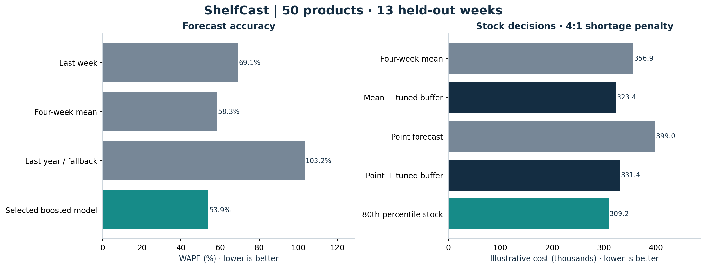
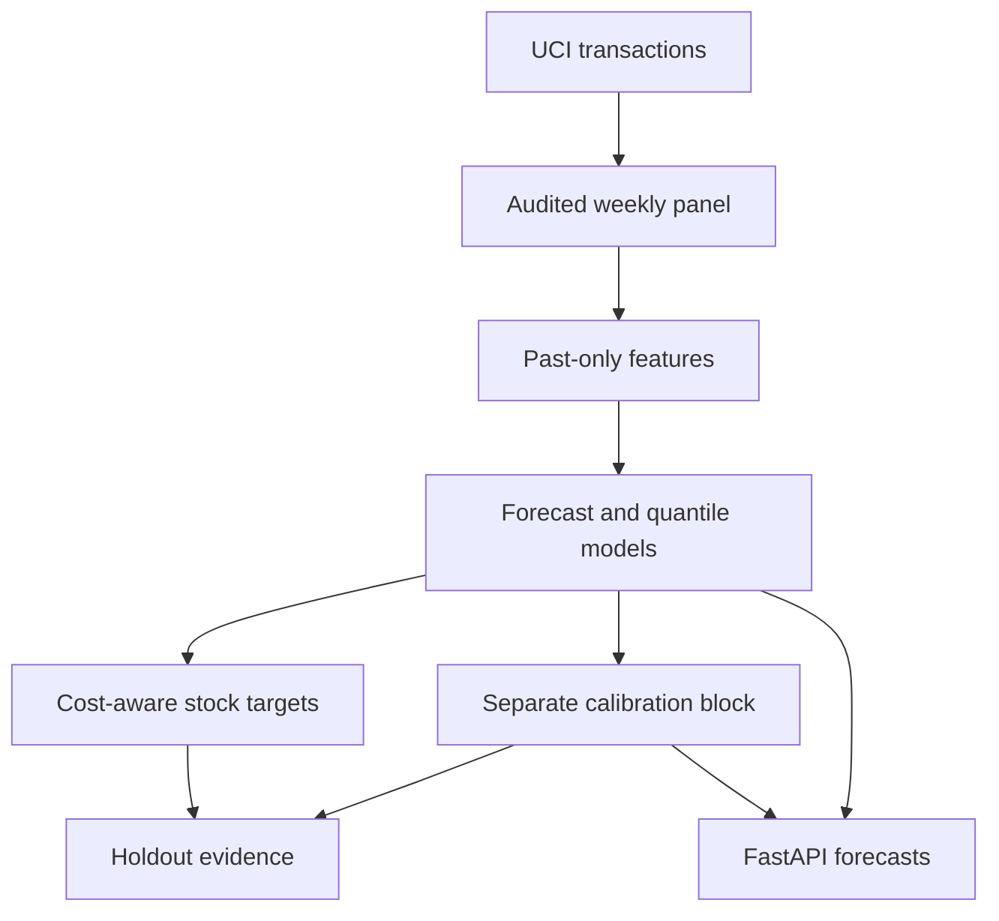

# ShelfCast

**How much should a retailer stock when next week's sales are uncertain?**

ShelfCast connects weekly retail forecasting, uncertainty calibration, and
inventory decisions. It turns **1.07 million real transaction records** from
UCI Online Retail II into an audited panel of **50 products × 104 weeks**, then
evaluates forecasts on a strictly later 13-week holdout.

The central finding: **a better point forecast is not automatically a better
stock decision**. Costs depend on which forecasting errors are more expensive.

[Experiment report](reports/RESULTS.md) · [Executed walkthrough](notebooks/walkthrough.ipynb) ·
[Methodology](docs/design.md) · [Data provenance](data/README.md)



## Results

| Question | Held-out result |
|---|---|
| Does the selected model beat a simple forecast? | WAPE **53.9%**, versus **58.3%** for a four-week mean: **7.6% relative reduction** |
| Do the intervals reflect uncertainty? | Nominal 80% intervals covered **82.0%** of product-weeks after calibration; **78.9%** before calibration |
| Does a cost-aware stock target help? | The 80th-percentile policy cost **4.4% less** than a validation-tuned mean-plus-buffer baseline in the specified scenario |
| Is the cost improvement conclusive? | No. The descriptive block-bootstrap interval is **−1.7% to +11.4%**, spanning zero |

Inventory costs are **hypothetical scenario units**, not observed business savings.
The remaining 53.9% WAPE reflects a difficult, variable wholesale/retail sales
series; the relative improvement does not imply accurate forecasts for every product.
All comparisons use the same 650 product-weeks. [Full results and limits](reports/RESULTS.md)

## What this project implements

- **Audited data preparation:** original-file checksum, explicit cleaning counts,
  training-only product selection, complete Monday-to-Sunday weeks, and zero-sales handling.
- **Forecasting:** last-week, four-week-mean, and annual baselines; pooled gradient-boosted
  models with Poisson or log-target loss, selected on later validation data.
- **Uncertainty:** conditional quantiles plus a separate, scaled residual calibration block.
  Empirical coverage and interval width are reported together.
- **Decisions:** single-period stock targets, asymmetric shortage/excess costs,
  validation-tuned baseline buffers, and paired weekly cost comparisons.
- **Serving:** a FastAPI endpoint using the exact offline feature builder, versioned
  artifacts, input validation, and explicit failure for unknown products or missing models.
- **Evaluation over time:** weekly forecast error, interval coverage, and cost-ratio sensitivity.

## Run the complete experiment

Use Python **3.11 or 3.12**. Commands run from the repository root; no GPU, account,
or external download is needed for the default benchmark.

```bash
python3 -m venv .venv
source .venv/bin/activate
python -m pip install --upgrade pip
python -m pip install -e '.[dev]'
shelfcast reproduce
pytest -q
```

The committed [weekly panel](data/weekly_sales.csv) is an attributed derivative of
the real source dataset. This command trains models and writes fresh reports,
forecasts, plots, and `model.joblib` to `outputs/`. It does not overwrite the
published evidence in `reports/`. The benchmark ran in approximately five seconds
in the recorded environment, excluding workbook download and parsing; other machines vary.

To rebuild the panel directly from the **43.5 MB UCI workbook**:

```bash
shelfcast reproduce --from-source --output outputs/from-source
```

The original workbook is checksum-verified. Full preparation takes longer than
training. Raw transactions and customer identifiers are not committed.
For the published direct dependency versions, use
`python -m pip install -r requirements-repro.txt` instead of the editable-install
command above. Transitive dependencies are not fully locked.

## Try a forecast

After `shelfcast reproduce`:

```bash
uvicorn shelfcast.api:app --host 127.0.0.1 --port 8000
```

In a second terminal:

```bash
curl http://127.0.0.1:8000/health
curl http://127.0.0.1:8000/products
curl -X POST http://127.0.0.1:8000/forecast \
  -H 'Content-Type: application/json' \
  --data @outputs/example_request.json
```

Open [API documentation](http://127.0.0.1:8000/docs) to explore requests. Supply a
known product, the forecast Monday, at least eight complete consecutive prior
weeks, and current inventory position. Supplying 52 weeks enables the annual lag.
The response contains a point forecast, calibrated interval, 80th-percentile stock
target, and `max(0, target − inventory_position)` as the suggested order quantity.

This is a historical research demo. The saved model is fitted through June 2011
and calibrated through August 2011; it is not a current retailer's live system.
The service does not execute orders, reserve stock, or infer future sales from customer data.
[Container and serving details](docs/serving.md)

## Evaluation design

| Block | Forecast Mondays | Purpose |
|---|---|---|
| Training | 2010-02-01 to 2011-04-25 | Fit candidate models; earlier eight weeks provide history |
| Validation | 2011-05-02 to 2011-06-27 | Select model complexity and stock buffers |
| Calibration | 2011-07-04 to 2011-08-29 | Calibrate intervals after refitting on training + validation |
| Test | 2011-09-05 to 2011-11-28 | Evaluate once with frozen weights and calibration |

Every prediction uses only weeks strictly before its forecast date. During test
replay, earlier realized test weeks become available history for the next
one-week-ahead forecast. Model parameters remain frozen. This is **rolling-origin
one-step evaluation**, not a 13-week forecast made all at once.



## Read the code

| Path | Responsibility |
|---|---|
| `src/shelfcast/data.py` | Data acquisition, cleaning audit, training-only cohort |
| `features.py` | Named features shared by training, replay, and serving |
| `models.py` | Model selection, quantiles, calibration, artifact loading |
| `evaluation.py` | Forecast metrics, stock costs, block bootstrap |
| `experiment.py`, `reporting.py` | Reproducible experiment and evidence generation |
| `api.py` | Typed forecast requests and model-backed responses |
| `tests/` | Leakage, chronology, calibration, stock decisions, serving parity |

## What the evidence does and does not establish

The data record **sales, not unconstrained demand**. A zero-sales week may reflect
no demand, a stockout, or delisting. Selected products are active, high-volume UK
items; results do not establish cold-start or all-catalog performance. Genuine
bulk orders are retained, while returns/cancellations are excluded rather than netted.

Stock evaluation assumes independent product-weeks, zero opening stock, immediate
replenishment, no capacity constraints, and no carryover. The cost ratio is a
declared scenario. Temporal and cross-product dependence mean standard conformal
exchangeability guarantees do not apply; actual coverage is measured on the holdout.

The log-target model reduces absolute forecast error but systematically underpredicts
high-volume weeks. Using its point estimate directly as stock produces **higher**
scenario cost than the simple mean baseline. Quantile targets address asymmetric
costs, at the price of holding more excess inventory. This tradeoff is visible in
the results rather than hidden behind a single accuracy score.

## Sources and attribution

- **Data:** Chen, D. (2012). [Online Retail II](https://doi.org/10.24432/C5CG6D),
  UCI Machine Learning Repository, [CC BY 4.0](https://creativecommons.org/licenses/by/4.0/).
  [Transformation and attribution details](data/README.md)
- **Temporal evaluation:** Hyndman & Athanasopoulos,
  [Forecasting: Principles and Practice, §5.10](https://otexts.com/fpp3/tscv.html).
- **Quantile models:** [scikit-learn quantile regression example](https://scikit-learn.org/stable/auto_examples/ensemble/plot_gradient_boosting_quantile.html).
- **Calibration method:** Romano, Patterson & Candès,
  [Conformalized Quantile Regression](https://arxiv.org/abs/1905.03222).

scikit-learn supplies the estimators. Project code implements the data audit,
time-safe feature pipeline, experiment protocol, calibration wrapper, decision
evaluation, and serving integration. The project was developed with AI assistance.
